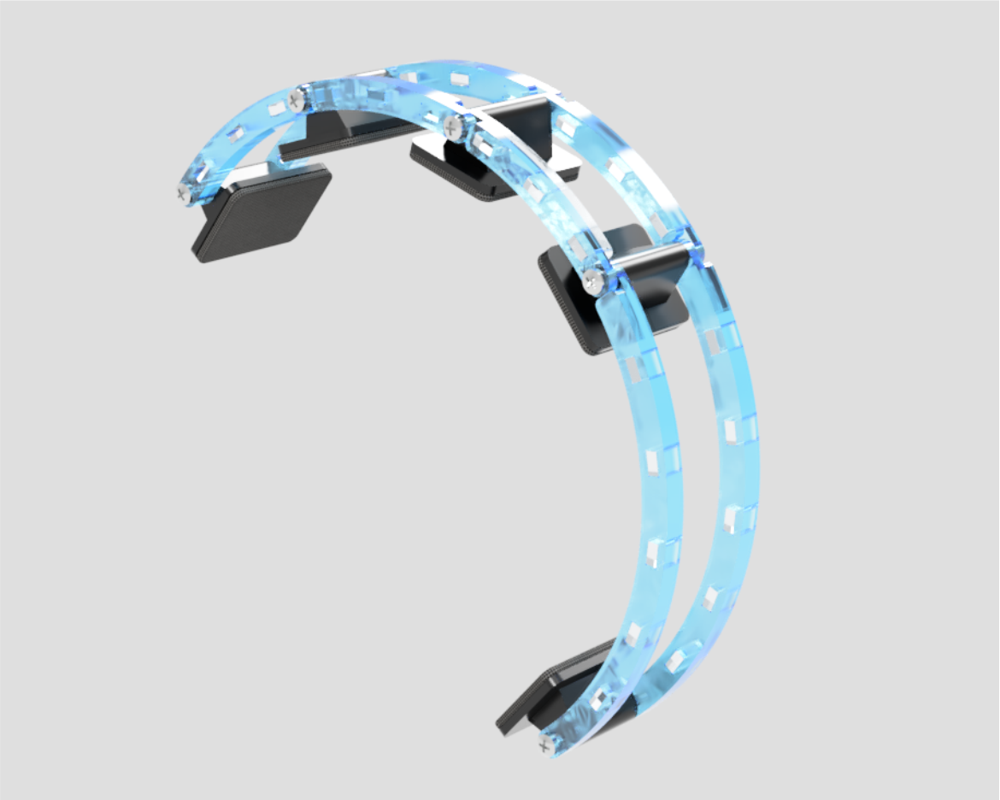

# EasyEG

Brain-Computer Interfaces (BCIs) are progressively adopted by the consumer market, making them available for a variety of use-cases. However, off-the-shelf BCIs are limited in their adjustments towards individual head shapes, evaluation of scalp-electrode contact, and extension through additional sensors. This work presents __EasyEG__, a BCI headset that is adaptable to individual head shapes and offers adjustable electrode-scalp contact to improve measuring quality. __EasyEG__ consists of 3D-printed and low-cost components that can be extended by additional sensing hardware, hence expanding the application domain of current BCIs.

## Construction Manual

The following steps explain how to assemble your own __EasyEG__.
You can produce the parts either by [3D-printing](3d-printer_only) or by combining [laser cutting and 3D-printing](lasercutter_and_3d-printer) if you have access to a laser cutter and an M4 tap.

### List of Materials

#### Produced Parts With 3D-Printing Only

- 9 x [Head Plate](3d-printer_only/rails/head-plate.stl)

- [Front Rail](3d-printer_only/rails/rail_front.stl) and [Front Rail Threaded](3d-printer_only/rails/rail_front_threaded.stl)
- 2 x [Top Rail](3d-printer_only/rails/rail_top.stl) and 2 x [Top Rail Threaded](3d-printer_only/rails/rail_top_threaded.stl)
- [Long Rail](3d-printer_only/rails/rail_long.stl) and [Long Rail Threaded](3d-printer_only/rails/rail_long_threaded.stl)
- [Long Side Rail](3d-printer_only/rails/rail_side_long.stl) and [Long Side Rail Threaded](3d-printer_only/rails/rail_side_long_threaded.stl)
- [Short Side Rail](3d-printer_only/rails/rail_side_short.stl) and [Short Side Rail Threaded](3d-printer_only/rails/rail_side_short_threaded.stl)

- 2 x [Main Clamp Top](3d-printer_only/clamps/main_clamp_top.stl) and 2 x [Main Clamp Bottom](3d-printer_only/clamps/main_clamp_bottom.stl)
- [Clamp Top](3d-printer_only/clamps/clamp_top.stl) and [Clamp Bottom](3d-printer_only/clamps/clamp_bottom.stl) each 1 per electrode on the sides + 1 for the BCI Case
- [Battery Clamp Top](3d-printer_only/clamps/battery_clamp_top.stl) and [Battery Clamp Bottom](3d-printer_only/clamps/battery_clamp_bottom.stl)

- one of each of the following for every electrode:
  - [Electrode Nut](3d-printer_only/electrode_mount/electrode_nut.stl)
  - [Electrode Mount](3d-printer_only/electrode_mount/electrode_mount.stl)
  - [Electrode Inner Slider](3d-printer_only/electrode_mount/electrode_inner_slider.stl)
  - [Electrode Outer Screw Part 1](3d-printer_only/electrode_mount/electrode_outer_screw_part1.stl)
  - [Electrode Outer Screw Part 2](3d-printer_only/electrode_mount/electrode_outer_screw_part2.stl)

- BCI-Case [Top](3d-printer_only/bci-case_top.stl) and [Bottom](3d-printer_only/mounting_accessory/bci-case_bottom.stl)

#### Produced Parts With Laser Cutting and 3D-Printing

- Laser cut the following sheets from 4mm acrylic:
  - [Rails](lasercutter_and_3d-printer/lasercut/easyeg_lasercut_rails.svg)
  - [Clamps](lasercutter_and_3d-printer/lasercut/easyeg_lasercut_rails.svg)
- 3D-print the following:
  - 9 x [Head Plate](lasercutter_and_3d-printer/3d-prints/head-plate.stl)
  - 4 x [Main Clamp Spacer](lasercutter_and_3d-printer/3d-prints/main_clamp_spacer.stl)
  - one of each of the following for every electrode:
    - [Electrode Nut](lasercutter_and_3d-printer/3d-prints/electrode_mount/electrode_nut.stl)
    - [Electrode Screw Sleeve](lasercutter_and_3d-printer/3d-prints/electrode_mount/electrode_screwsleeve.stl)
    - [Electrode Mount](lasercutter_and_3d-printer/3d-prints/electrode_mount/electrode_mount.stl)
    - [Electrode Inner Slider](lasercutter_and_3d-printer/3d-prints/electrode_mount/electrode_inner_slider.stl)
    - [Electrode Outer Screw Part 1](lasercutter_and_3d-printer/3d-prints/electrode_mount/electrode_outer_screw_part1.stl)
    - [Electrode Outer Screw Part 2](lasercutter_and_3d-printer/3d-prints/electrode_mount/electrode_outer_screw_part2.stl)
  - BCI-Case [Top](lasercutter_and_3d-printer/3d-prints/bci-case_top.stl) and [Bottom](lasercutter_and_3d-printer/3d-prints/bci-case_bottom.stl)
  - [Battery Mount](lasercutter_and_3d-printer/3d-prints/battery_mount.stl)
  - 2 x [Electrode Nut](lasercutter_and_3d-printer/3d-prints/electrode_mount/electrode_nut.stl) for case and battery pack
  - 2 x [Electrode Screwcollet](lasercutter_and_3d-printer/3d-prints/electrode_mount/electrode_screwcollet.stl) for case and battery pack

#### External Parts
- [OpenBCI Ganglion Board](https://shop.openbci.com/products/ganglion-board?variant=13461804483) with battery pack
- [Gold Cup Electrodes](https://shop.openbci.com/collections/frontpage/products/openbci-gold-cup-electrodes?variant=9056028163)
- 1 screw and - M1.6 x 6mm and 1 nut M1.6 for every electrode you want to attach
- 1 compression spring - 12mm x 35mm (thickness 0.6mm - 0.8mm) for every electrode you want to attach
- 13 screws - M4 x 50mm for assembling the rails
- 2 self-cutting countersunk screws - 3.0 x 12mm for mounting the battery pack
- 4 self-cutting flathead screws - 3.0 x 6.5mm for closing the BCI case
- foam or soft fabric to cushion the head plates

### Assemble the Rails

To assemble a rail take the two parts of the rail and connect them with the rectangular dowels.
They should have a good pressure fit and don't need glue.

Pay attention to the direction of each rail and which side should accept the screws.
This will later determine from which side you adjust the rails.

The rails have two sizes of holes on their ends.
The smaller holes have to be tapped with an M4 tap to later accept the screws.

### Assemble the Clamps

The clamps have each an upper and a lower half and will hold the electrodes.
To assemble the upper half insert the concave brakes and the guiding plates in the top Plate.

The lower half takes the convex brakes.
Again, it should be a good pressure fit.

The main clamps (bigger top and bottom plate without rounded corners) take an electrode and will connect the side rails with the center rails.
They are built in the same way as the normal Clamps but take additional four pieces on the sides to later hold the side rails.

### 3D-Printed Alternatives

If you 3D-printed everything the rails and halves of the clamps are already assembled and tapped.
The orientation of the printed rails is planned to later accept screws from the right.
If you want to change this, mirror the rails before printing.

### Electrode Mounts

The electrodes are screwed to the small piece of the electrode mounts (M1.6 screw and nut).
After screwing the electrode down, you can carefully bend the electrode shaft upwards to later fit the slider of the mount.

Thread the electrode wire through the slider and the spring.
Then push the screwed down electrode in the lower end of the slider.
There is a recess to accept the shaft of the electrode.
To finish the mount surround the slider and the spring with the two halves of the outer screw.
It is no problem if the halves don't stay in place on their own as they will be held together later by the screw sleeve.

### Assemble Accessory Mounts
The battery pack to power the BCI is mounted on a special clamp.
It is built the same way as the normal clamps but has a peak with a hole on each side.
To mount the battery pack, it is screwed down on the 3D-printed battery mount plate (self-cutting countersunk screws).
The screws should also extend to the battery mount clamp.
This way the plate and the clamp are joined by the screws and later by the screw sleeve from below.

The Case for the BCI module consists of two parts (top and bottom).
Place the plastic feet of the module in the recesses of the case.
The closed Case can be crewed together with four screws from the sides (self-cutting flathead screws).

### Assemble the Helmet

Before assembling the Helmet attach the foam or fabric to the head plates.

The center rails will be built first
There should be always two corresponding rails that are mirrored (except for the thread on one side).
They are joined with one of the M4 screws, with a head plate between the rails.
The next rails will follow the same way, while the screw also joins the new rails with the existing ones.

With the center rails build, the side rails can be attached.
For every side rail, one of the main clamps is taken and clamped around the center rails.
This happens by fixing them with a screw sleeve and a printed nut. (For the 3D-printed versions, only the nut is needed, as the screw sleeve is already attached.)
The electrode mounts can be inserted now or later.

To support the side rail attachment points on the main clamps one 3D-printed spacer is inserted on each side of the clamp
(only for the laser cut version).

The side rails are added by screwing them (M4 Screw) through the spacer to the main clamp.
At the front of each side rail, a head plate is attached the same way as to the center rails.
Using the normal clamps, further electrodes can be attached to the side rails, in the same way as the main clamps to the center rails before.

Following these steps, all needed electrodes and all short and long side rails can be attached.

After adding the BCI and battery pack (again the same way as the other clamps), all is left to do is the wiring.

### Your EasyEG Is Ready To Use!

