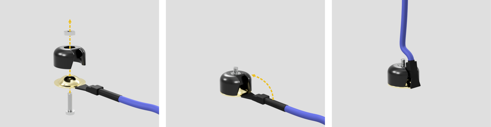

# EasyEG

Brain-Computer Interfaces (BCIs) are progressively adopted by the consumer market, making them available for a variety of use-cases. However, off-the-shelf BCIs are limited in their adjustments towards individual head shapes, evaluation of scalp-electrode contact, and extension through additional sensors. This work presents __EasyEG__, a BCI headset that is adaptable to individual head shapes and offers adjustable electrode-scalp contact to improve measuring quality. __EasyEG__ consists of 3D-printed and low-cost components that can be extended by additional sensing hardware, hence expanding the application domain of current BCIs.

## Construction Manual

The following steps explain how to assamble your own __EasyEG__.
You can produce the parts either by [3D-printing](3d-printer_only), or by combining [laser cutting and 3D-printing](lasercutter_and_3d-printer), if you have access to a laser cutter and an M4 tap.

### Material List

#### Produced parts with 3D-printing only

- 9 x [Head Plate](3d-printer_only/rails/head-plate.stl)

- [Front Rail](3d-printer_only/rails/rail_front.stl) and [Front Rail Threaded](3d-printer_only/rails/rail_front_threaded.stl)
- 2 x [Top Rail](3d-printer_only/rails/rail_top.stl) and 2 x [Top Rail Threaded](3d-printer_only/rails/rail_top_threaded.stl)
- [Long Rail](3d-printer_only/rails/rail_long.stl) and [Long Rail Threaded](3d-printer_only/rails/rail_long_threaded.stl)
- [Long Side Rail](3d-printer_only/rails/rail_side_long.stl) and [Long Side Rail Threaded](3d-printer_only/rails/rail_side_long_threaded.stl)
- [Short Side Rail](3d-printer_only/rails/rail_side_short.stl) and [Short Side Rail Threaded](3d-printer_only/rails/rail_side_short_threaded.stl)

- 2 x [Main Clamp Top](3d-printer_only/clamps/main_clamp_top.stl) and 2 x [Main Clamp Bottom](3d-printer_only/clamps/main_clamp_bottom.stl)
- [Clamp Top](3d-printer_only/clamps/clamp_top.stl) and [Clamp Bottom](3d-printer_only/clamps/clamp_bottom.stl) each 1 per electrode on the sides + 1 for the BCI Case
- [Battery Clamp Top](3d-printer_only/clamps/battery_clamp_top.stl) and [Battery Clamp Bottom](3d-printer_only/clamps/battery_clamp_bottom.stl)

- one of each of the following for every electrode:
  - [Electrode Nut](3d-printer_only/electrode_mount/electrode_nut.stl)
  - [Electrode Mount](3d-printer_only/electrode_mount/electrode_mount.stl)
  - [Electrode Inner Slider](3d-printer_only/electrode_mount/electrode_inner_slider.stl)
  - [Electrode Outer Screw Part 1](3d-printer_only/electrode_mount/electrode_outer_screw_part1.stl)
  - [Electrode Outer Screw Part 2](3d-printer_only/electrode_mount/electrode_outer_screw_part2.stl)

#### Produced parts with laser cutting

- Laser cut the following sheets from 4mm acrylic:
  - [Rails](lasercutter_and_3d-printer/lasercut/easyeg_lasercut_rails.svg)
  - [Clamps](lasercutter_and_3d-printer/lasercut/easyeg_lasercut_rails.svg)
- 3D-print the following:
  - 9 x [Head Plate](lasercutter_and_3d-printer/3d-prints/head-plate.stl)
  - 4 x [Main Clamp Spacer](lasercutter_and_3d-printer/3d-prints/main_clamp_spacer.stl)
  - one of each of the following for every electrode:
    - [Electrode Nut](lasercutter_and_3d-printer/3d-prints/electrode_mount/electrode_nut.stl)
    - [Electrode Screwcollet](lasercutter_and_3d-printer/3d-prints/electrode_mount/electrode_screwcollet.stl)
    - [Electrode Mount](lasercutter_and_3d-printer/3d-prints/electrode_mount/electrode_mount.stl)
    - [Electrode Inner Slider](lasercutter_and_3d-printer/3d-prints/electrode_mount/electrode_inner_slider.stl)
    - [Electrode Outer Screw Part 1](lasercutter_and_3d-printer/3d-prints/electrode_mount/electrode_outer_screw_part1.stl)
    - [Electrode Outer Screw Part 2](lasercutter_and_3d-printer/3d-prints/electrode_mount/electrode_outer_screw_part2.stl)
  - BCI-Case [Top](lasercutter_and_3d-printer/3d-prints/bci-case_top.stl) and [bottom](lasercutter_and_3d-printer/3d-prints/bci-case_bottom.stl)
  - [Battery Mount](lasercutter_and_3d-printer/3d-prints/battery_mount.stl)
  - 2 x [Electrode Nut](lasercutter_and_3d-printer/3d-prints/electrode_mount/electrode_nut.stl) for case and battery pack
  - 2 x [Electrode Screwcollet](lasercutter_and_3d-printer/3d-prints/electrode_mount/electrode_screwcollet.stl) for case and battery pack

#### External Parts
- [OpenBCI Ganglion Board](https://shop.openbci.com/products/ganglion-board?variant=13461804483) with battery pack
- [Gold Cup Electrodes](https://shop.openbci.com/collections/frontpage/products/openbci-gold-cup-electrodes?variant=9056028163)
- 1 screw and - M1.6 x 6mm and 1 nut M1.6 for every electrode you want to attach
- 1 compression spring - 12mm x 35mm (thickness 0.6mm - 0.8mm) for every electrode you want to attach
- 13 screws - M4 x 50mm for assembling the rails
- 2 self cutting countersunk screws - 3.0 x 12mm for mounting the battery pack
- 4 self cutting flathead screws - 3.0 x 6.5mm for closing the bci case
- foam or soft fabric to cushion the head plates

### Assemble the Rails

assemble the Rails | direction

make threads

### Assemble the Clamps

assamble the clamp

### 3D-Printed Alternatives

### Electrode Mounts

### Assemble Accessory Mounts

### Assemble the Helmet

attach foam / fabric

### Your EasyEG Is Ready To Use!

